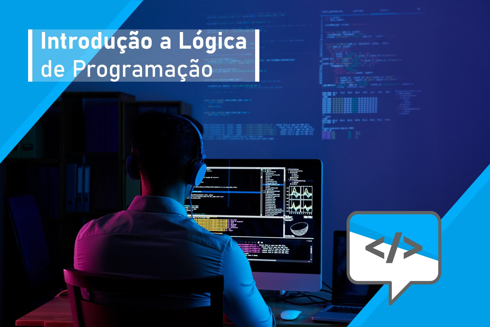

# Introdução à Programação

Bem-vindo ao repositório do curso "Introdução à Programação". Este curso tem como objetivo fornecer uma base sólida para quem está começando a explorar o mundo da programação. Os tópicos cobertos incluem:

- [Lógica de Programação](logica-programacao.md)
- [Algoritmos e Estruturas de Controle](algoritmos-estruturas.md)
- [Variáveis e Tipos de Dados](variaveis-tipos-dados.md)
- [Resolução de Problemas com Algoritmos](resolucao-problemas.md)

## Conteúdo do Curso

### Lógica de Programação

Neste tópico, você aprenderá os fundamentos da lógica de programação, incluindo como desenvolver algoritmos e abordar problemas de maneira estruturada.

- [Detalhes](logica-programacao.md)

### Algoritmos e Estruturas de Controle

Explore algoritmos, estruturas de controle de fluxo e tomadas de decisão em programação, fundamentais para a resolução de problemas.

- [Detalhes](algoritmos-estruturas.md)

### Variáveis e Tipos de Dados

Este tópico abrange o uso de variáveis e tipos de dados em programação, fornecendo uma compreensão sólida dos conceitos essenciais.

- [Detalhes](variaveis-tipos-dados.md)

### Resolução de Problemas com Algoritmos

Aprenda a abordar e resolver problemas de programação usando algoritmos e técnicas eficazes.

- [Detalhes](resolucao-problemas.md)

## Conteúdo Adicional

### Exemplos

Confira exemplos práticos para ilustrar conceitos-chave.

- [Detalhes](exemplos.md)

### Exercícios

Pratique o que aprendeu com um conjunto de exercícios desafiadores.

- [Detalhes](exercicios.md)

## Como Contribuir

Se você deseja contribuir para este repositório, sinta-se à vontade para criar problemas (issues) ou enviar solicitações de pull (pull requests). Seu feedback e contribuições são bem-vindos!

## Configuração do Ambiente

Para começar, siga nosso guia sobre como configurar um ambiente de desenvolvimento para a prática.

- [Configuração do Ambiente](ambiente-desenvolvimento.md)

## Recursos Extras

Explore recursos adicionais que podem enriquecer sua jornada de aprendizado em programação.

- [Links Úteis](links-uteis.md): Links para recursos relacionados à programação.
- [Bibliografia](bibliografia.md): Lista de livros e materiais recomendados.
