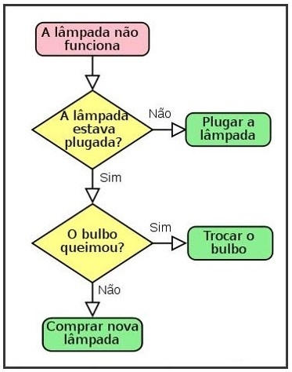

# Algoritmos e Estruturas de Controle

Bem-vindo à seção de Algoritmos e Estruturas de Controle do curso "Introdução à Programação". Este módulo é crucial para o desenvolvimento de habilidades de programação e resolução de problemas.

## Introdução a Algoritmos

### O Que São Algoritmos?

Um algoritmo é um conjunto de instruções que descreve um processo ou procedimento específico. Algoritmos são a base da programação e são usados para resolver problemas.

### Importância da Eficiência

Além de funcionar corretamente, os algoritmos devem ser eficientes. Isso significa que eles devem executar tarefas de maneira rápida e consumir recursos mínimos.

## Estruturas Condicionais

As estruturas condicionais permitem que um programa tome decisões com base em condições específicas. Vamos explorar as principais estruturas condicionais:

### `if` e `else`

A instrução `if` permite que você tome decisões com base em uma condição. A instrução `else` oferece uma alternativa caso a condição não seja atendida.

### `switch`

A instrução `switch` é usada para escolher uma ação com base em um conjunto de valores possíveis. Ela é uma alternativa eficiente para várias instruções `if`.

## Laços de Repetição

Os laços de repetição permitem que um conjunto de ações seja executado repetidamente enquanto uma condição for verdadeira. Vamos explorar os laços de repetição mais comuns:

### `for`

A estrutura de repetição `for` é usada quando você sabe quantas vezes uma ação deve ser repetida. É ideal para percorrer listas e coleções de dados.

### `while`

A estrutura `while` executa um bloco de código enquanto uma condição for verdadeira. Ela é útil quando o número de repetições não é conhecido antecipadamente.

### `do-while`

A estrutura `do-while` é semelhante ao `while`, mas garante que o bloco de código seja executado pelo menos uma vez antes de verificar a condição.

## Exemplos Práticos e Exercícios

A melhor maneira de aprender algoritmos e estruturas de controle é através da prática. Oferecemos exemplos práticos e exercícios desafiadores:

### Exemplos de Código

Nossos exemplos de código são projetados para ilustrar os conceitos e fornecer soluções práticas para problemas comuns.

### Exercícios de Programação

Os exercícios são uma oportunidade para você aplicar o que aprendeu. Eles variam em complexidade e cobrem uma ampla gama de cenários de programação.

### Projetos Práticos

Recomendamos a realização de pequenos projetos práticos para consolidar seu conhecimento. Isso permitirá que você crie programas reais.

## Recursos Adicionais

Para aprofundar seus conhecimentos em algoritmos e estruturas de controle, recomendamos explorar os seguintes recursos:

- [Livros recomendados](bibliografia.md) sobre algoritmos e estruturas de controle.
- [Links úteis](links-uteis.md) para tutoriais e cursos online relacionados.

## Próximo Tópico

Agora que você adquiriu uma compreensão sólida de algoritmos e estruturas de controle, estamos prontos para avançar para o próximo tópico: "Variáveis e Tipos de Dados". Continue praticando e aprimorando suas habilidades à medida que progredimos em sua jornada de aprendizado.
