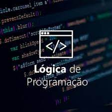

# Lógica de Programação

Bem-vindo à seção de Lógica de Programação do curso "Introdução à Programação". Neste módulo, você aprenderá os princípios fundamentais que servirão de alicerce para sua jornada no mundo da programação.

## Introdução à Lógica de Programação

### O Que é Lógica de Programação?

A lógica de programação é a arte de criar algoritmos eficazes que resolvem problemas e realizam tarefas. É o processo de organizar pensamentos e ações de maneira lógica, permitindo a construção de programas de computador. Este é o ponto de partida para qualquer desenvolvedor.

### A Importância da Lógica na Programação

A lógica é fundamental na programação. Ela permite que você:

- Pense de forma estruturada.
- Desenvolva soluções para problemas complexos.
- Crie algoritmos claros e eficientes.
- Depure e otimize seu código.

### Organizando Algoritmos

Uma parte essencial da lógica de programação é organizar algoritmos de forma clara e legível. Algumas práticas incluem:

- Uso de pseudocódigo.
- Compreensão da sequência lógica das ações.
- Comentários significativos.

## Estruturas de Controle

As estruturas de controle são ferramentas cruciais para orientar o fluxo de execução de um programa. Elas incluem:

### Sequência

A estrutura de sequência representa a execução de ações em ordem, uma após a outra. É a forma mais simples de controle de fluxo e é usada em tarefas sequenciais.

### Seleção

As estruturas de seleção permitem que um programa tome decisões com base em condições específicas. Isso inclui instruções condicionais como `if`, `else` e `switch`.

### Repetição

As estruturas de repetição permitem que um conjunto de ações seja executado repetidamente, com base em uma condição. Isso inclui loops como `for`, `while` e `do-while`.

## Exemplos Práticos e Exercícios

Para solidificar o seu conhecimento em lógica de programação, a prática é essencial. Nesta seção, forneceremos exemplos práticos que ilustram os conceitos apresentados. 

### Exemplos de Código

Nossos exemplos de código são práticos e fáceis de entender, cobrindo diversos cenários que você pode encontrar na programação.

### Exercícios

A prática leva à excelência. Oferecemos uma série de exercícios desafiadores para testar seu entendimento dos conceitos. Experimente resolver esses problemas para aprimorar suas habilidades.

## Projetos Práticos

Para consolidar o que aprendeu em lógica de programação, recomendamos a realização de pequenos projetos práticos. Isso permite que você aplique seus conhecimentos e crie programas reais.

## Recursos Adicionais

Para aprofundar ainda mais o seu conhecimento, aqui estão alguns recursos adicionais:

- [Livros recomendados](bibliografia.md) sobre lógica de programação.
- [Links úteis](links-uteis.md) para tutoriais e cursos online relacionados à lógica de programação.

## Próximo Tópico

Agora que você possui uma compreensão sólida da lógica de programação, estamos prontos para avançar para o próximo tópico: "Algoritmos e Estruturas de Controle". Continue a aprofundar seus conhecimentos e pratique o que aprendeu.

Sinta-se à vontade para fazer perguntas, explorar os exemplos e trabalhar nos exercícios para fortalecer suas habilidades em lógica de programação. Estamos aqui para ajudá-lo em sua jornada de aprendizado.
