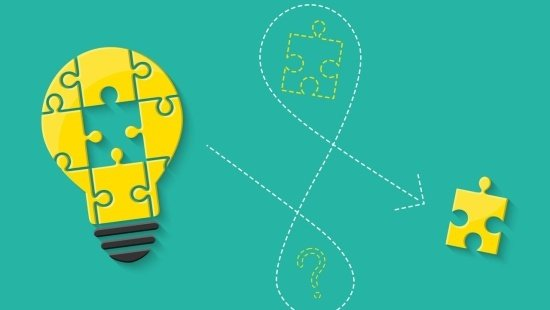

# Resolução de Problemas com Algoritmos

Bem-vindo à seção de Resolução de Problemas com Algoritmos do curso "Introdução à Programação". Neste módulo, você aprenderá estratégias eficazes para abordar e resolver problemas de programação.

## Estratégias para Resolução de Problemas

Resolução de problemas é uma habilidade crítica para programadores. Nesta seção, exploraremos estratégias que o ajudarão a abordar problemas complexos de forma estruturada e eficiente:

### Compreensão do Problema

A primeira etapa na resolução de problemas é entender completamente o problema. Isso envolve ler atentamente a descrição do problema, identificar entradas e saídas, bem como os requisitos.

### Planejamento e Pseudocódigo

A criação de um plano e pseudocódigo é uma etapa fundamental. Descrever o algoritmo em linguagem humana antes de codificá-lo ajuda a organizar seus pensamentos.

### Divisão e Conquista

A abordagem de divisão e conquista envolve dividir um problema complexo em problemas menores e mais gerenciáveis. Isso facilita a resolução do problema principal.

### Teste e Depuração

Testar seu algoritmo é crucial para identificar erros e fazer ajustes. A depuração é uma parte essencial do processo de resolução de problemas.

## Exemplos de Problemas e Soluções

A melhor maneira de aprender a resolver problemas é através de exemplos práticos. Vamos explorar problemas comuns e suas soluções:

- [Encontrar o Maior Elemento em uma Lista](problema-maior-elemento.md)
- [Ordenar uma Lista em Ordem Crescente](problema-ordenacao.md)
- [Verificar se um Número é Primo](problema-numero-primo.md)

## Exercícios Desafiadores

A prática é essencial para o desenvolvimento de habilidades de resolução de problemas. Nesta seção, você encontrará exercícios desafiadores que testarão sua capacidade de aplicar estratégias de resolução de problemas.

## Projetos Práticos

Além dos exercícios, recomendamos a criação de pequenos projetos práticos que envolvam a resolução de problemas do mundo real. Isso lhe dará a experiência de aplicar as estratégias em cenários reais.

## Recursos Adicionais

Para aprofundar seus conhecimentos na resolução de problemas com algoritmos, aqui estão alguns recursos adicionais:

- [Livros recomendados](bibliografia.md) sobre resolução de problemas em programação.
- [Links úteis](links-uteis.md) para tutoriais e cursos online relacionados à resolução de problemas com algoritmos.

## Próximo Tópico

Agora que você adquiriu habilidades sólidas em resolução de problemas com algoritmos, estamos prontos para avançar para tópicos mais avançados. Continue praticando e aplicando suas habilidades à medida que avançamos em sua jornada de aprendizado.
