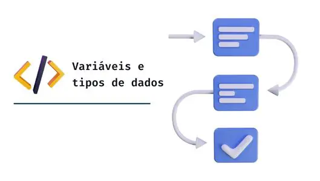

# Variáveis e Tipos de Dados

Bem-vindo à seção de Variáveis e Tipos de Dados do curso "Introdução à Programação". Neste módulo, você aprenderá sobre a importância das variáveis e os diferentes tipos de dados utilizados na programação.

## Introdução a Variáveis e Tipos de Dados

### O Que São Variáveis?

Em programação, variáveis são usadas para armazenar e manipular dados. Elas desempenham um papel fundamental no desenvolvimento de software, permitindo que você armazene informações e realize cálculos.

### Tipos de Dados Fundamentais

Os tipos de dados são categorias que definem quais valores as variáveis podem armazenar. Abordaremos os tipos de dados mais comuns, incluindo:

- Inteiros (int)
- Ponto flutuante (float)
- Texto (string)
- Booleanos (bool)

### Declaração de Variáveis

Você aprenderá como declarar variáveis em diferentes linguagens de programação. A declaração de variáveis envolve a atribuição de um nome e um tipo de dados.

### Conversões de Tipos de Dados

Às vezes, é necessário converter dados de um tipo para outro. Abordaremos como realizar conversões de tipos de dados de maneira segura e eficiente.

## Exemplos Práticos e Exercícios

A prática é essencial para o domínio de variáveis e tipos de dados. Forneceremos exemplos práticos e exercícios para reforçar seu entendimento:

### Exemplos de Código

Nossos exemplos de código são projetados para ilustrar o uso de variáveis e tipos de dados em cenários do mundo real.

### Exercícios de Prática

Os exercícios de prática oferecem oportunidades para aplicar o conhecimento adquirido. Eles variam em complexidade, proporcionando desafios adequados ao seu nível de habilidade.

## Projetos Práticos

Recomendamos a criação de pequenos projetos práticos que envolvam o uso de variáveis e tipos de dados. Isso lhe dará a experiência de aplicar conceitos em situações reais.

## Recursos Adicionais

Para aprofundar seus conhecimentos em variáveis e tipos de dados, aqui estão alguns recursos adicionais:

- [Livros recomendados](bibliografia.md) sobre programação com variáveis e tipos de dados.
- [Links úteis](links-uteis.md) para tutoriais e cursos online relacionados.

## Próximo Tópico

Agora que você entende a importância das variáveis e dos tipos de dados, estamos prontos para avançar para o próximo tópico: "Resolução de Problemas com Algoritmos". Continue praticando e consolidando seu conhecimento à medida que avançamos em sua jornada de aprendizado.
